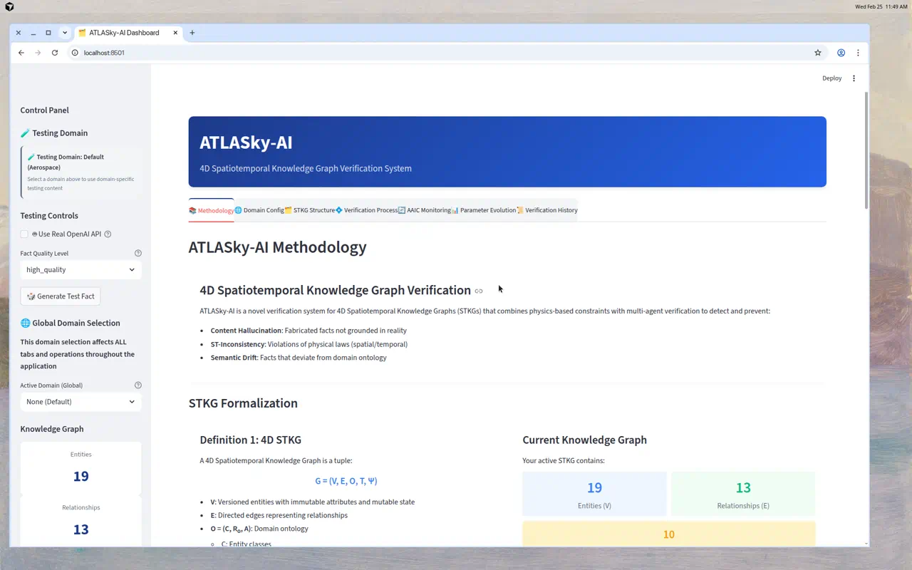
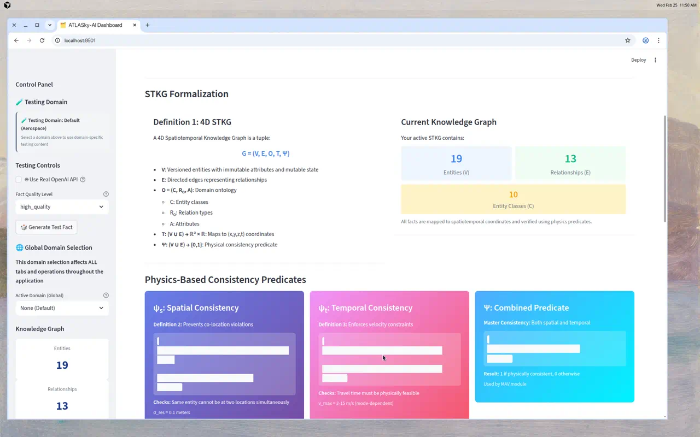
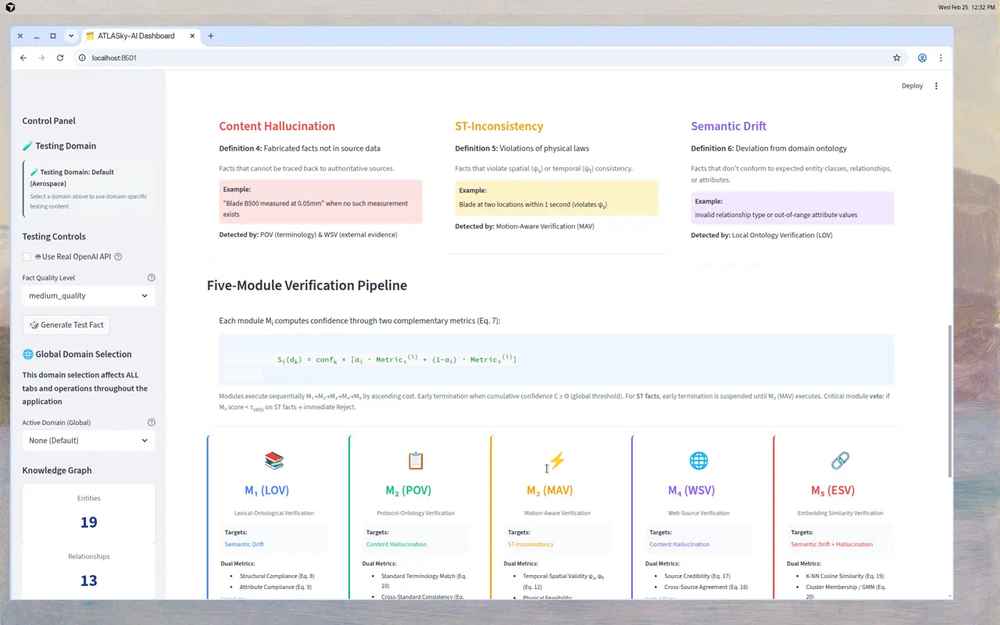
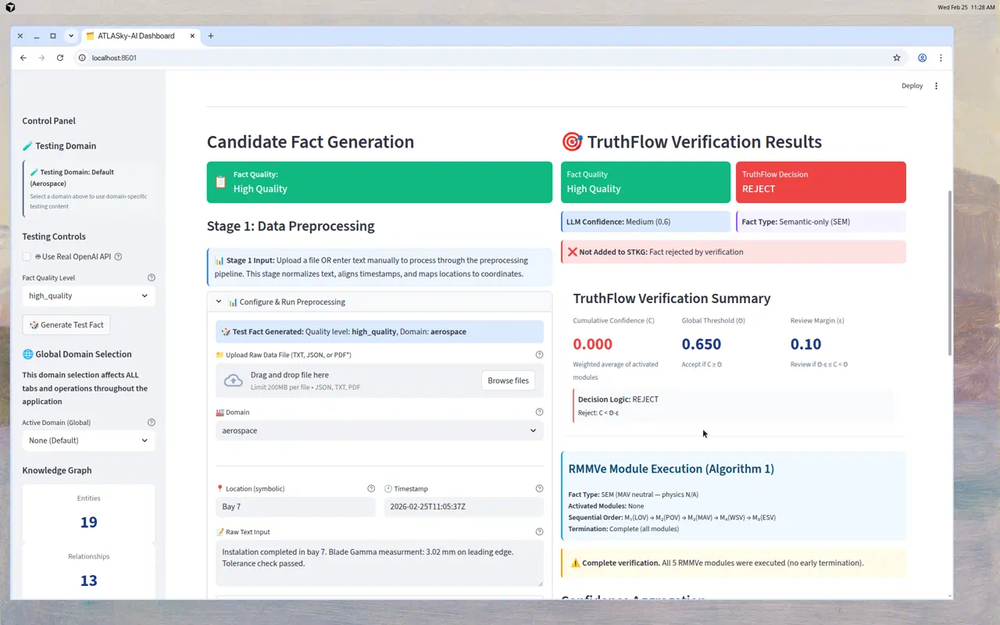
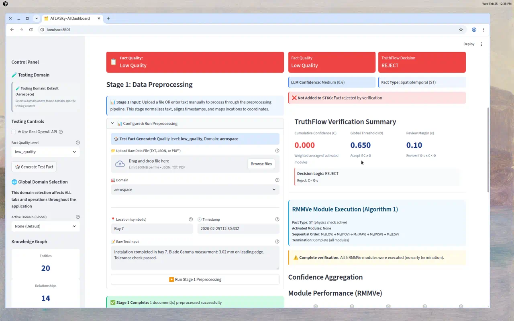
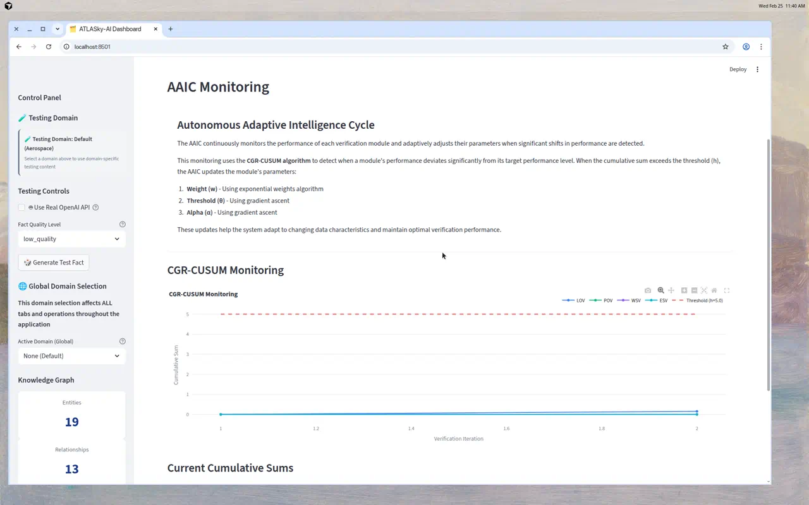

# ATLASky-AI

## Multi-Domain 4D Spatiotemporal Knowledge Graph Verification System

ATLASky-AI is a domain-adaptable verification system for 4D Spatiotemporal Knowledge Graphs (STKGs) that combines physics-based constraints with multi-modal verification to detect and prevent:

- **Content Hallucination**: Fabricated facts not grounded in reality
- **ST-Inconsistency**: Violations of physical laws (spatial/temporal)
- **Semantic Drift**: Facts that deviate from domain ontology

---

## Demo — See It In Action

### Dashboard Overview

<p align="center">
  
</p>

The interactive dashboard shows the STKG formalization **G = (V, E, O, T, Ψ)** with live knowledge graph metrics and physics-based consistency predicates:

<p align="center">
  
</p>

### Five-Module Verification Pipeline

Each candidate fact passes through 5 modules sequentially (M₁→M₅), each computing dual metrics. Early termination occurs when cumulative confidence exceeds the global threshold.

<p align="center">
  
</p>

### Verification Results — Accept vs. Reject

The system classifies facts as **ST** (spatiotemporal) or **SEM** (semantic-only) and applies a three-way decision: **Accept** / **Review** / **Reject**.

| Verification Result | Screenshot |
|---|---|
| TruthFlow output with module scores, cumulative confidence, and decision logic |  |
| Low-quality fact with invalid entity and timestamp correctly **REJECTED** |  |

### AAIC Adaptive Monitoring

The Autonomous Adaptive Intelligence Cycle (AAIC) monitors module performance via CGR-CUSUM and adapts weights, thresholds, and alpha parameters when distribution shifts are detected.

<p align="center">
  
</p>

### CLI Verification Demo

Run `python3 test_verification_demo.py` to see all quality cases processed through the pipeline:

```
================================================================================
  Test Case: HIGH_QUALITY
================================================================================
Candidate Fact Quality: high_quality
Fact Type: ST
Decision: ✅ ACCEPT
Cumulative Confidence: 0.8333 (Threshold: 0.65)
Early Termination: True — Terminated at Module: MAV

Activated Modules: LOV, MAV
Module Scores:
  LOV: 0.7000 (threshold: 0.70) [✓]  Metric1: 1.0000 | Metric2: 0.0000
  POV: 0.6100 (threshold: 0.70) [✗]  Metric1: 0.4000 | Metric2: 1.0000
  MAV: 1.0000 (threshold: 0.65) [✓]  Metric1: 1.0000 | Metric2: 1.0000

================================================================================
  Test Case: LOW_QUALITY
================================================================================
Candidate Fact Quality: low_quality
Fact Type: SEM
Decision: ❌ REJECT
Cumulative Confidence: 0.0000 (Threshold: 0.65)
Early Termination: False

Activated Modules: (none)
Module Scores:
  LOV: 0.5333 (threshold: 0.70) [✗]  Metric1: 0.3333 | Metric2: 1.0000
  POV: 0.1300 (threshold: 0.70) [✗]  Metric1: 0.2000 | Metric2: 0.0000
  MAV: 1.0000 (threshold: 0.65) [✓]  Metric1: 1.0000 | Metric2: 1.0000  ← neutral (SEM)
  WSV: 0.3500 (threshold: 0.60) [✗]  Metric1: 0.0000 | Metric2: 1.0000
  ESV: 0.5175 (threshold: 0.65) [✗]  Metric1: 0.7393 | Metric2: 0.0000
```

**What's happening:**

- **HIGH_QUALITY** → Fact type **ST** (valid coordinates). LOV confirms structural compliance (Metric₁=1.0). MAV confirms physics consistency (ψ_s=1, ψ_t=1). Cumulative confidence 0.83 ≥ 0.65 → **ACCEPT** with early termination at M₃.

- **LOW_QUALITY** → Fact type **SEM** (invalid timestamp `202X-12-5`). LOV detects unknown entity class (Metric₁=0.33). POV detects non-standard terminology and invalid tools (Metric₁=0.20). MAV neutral (SEM fact, physics N/A). WSV finds no corroboration. ESV detects statistical anomaly. No modules reach activation threshold → C=0.0 → **REJECT**.

---

## System Architecture

### 4D STKG Formalization

ATLASky-AI operates on a formal 4D STKG defined as **G = (V, E, O, T, Ψ)** where:

- **V**: Versioned entities with immutable attributes and mutable state
- **E**: Directed edges representing relationships
- **O = (C, R_o, A)**: Domain ontology with entity classes, relation types, and attributes
- **T: (V ∪ E) → ℝ³ × ℝ**: Maps entities/relations to spatiotemporal coordinates (x,y,z,t)
- **Ψ: (V ∪ E) → {0,1}**: Physical consistency predicate combining spatial (ψ_s) and temporal (ψ_t) consistency

### Physics-Based Predicates

- **ψ_s (Spatial Consistency)**: Prevents co-location violations — same entity cannot exist at two separated locations within the same time window
- **ψ_t (Temporal Consistency)**: Enforces velocity and travel-time constraints — travel time must be physically feasible given distance and maximum velocity
- **Ψ = ψ_s ∧ ψ_t**: Combined predicate ensuring full physical consistency

### Three-Stage Pipeline

1. **Stage 1 — Data Preprocessing**: Normalizes heterogeneous raw data RD into structured format RD' (OCR, spell correction, terminology standardization via ontology O, temporal alignment to UTC, spatial validation via facility maps)
2. **Stage 2 — LLM-Based Extraction**: Generates candidate facts D = L(RD'; P) using domain-specialized prompts with confidence-weighted output d_k = ⟨s, r, o, T(d_k), conf_k⟩ where conf_k ∈ {high=1.0, medium=0.8, low=0.6}
3. **Stage 3 — TruthFlow Verification**: Validates candidates through Ranked Multi-Modal Verification (RMMVe) with Autonomous Adaptive Intelligence Cycle (AAIC)

### Five-Module Verification Pipeline (RMMVe)

Each module M_i computes confidence through two complementary metrics:

**S_i(d_k) = conf_k × [α_i · Metric₁ + (1−α_i) · Metric₂]**

| Module | Full Name | Primary Target | Dual Metrics | Cost |
|--------|-----------|----------------|--------------|------|
| M₁ (LOV) | Lexical-Ontological Verification | Semantic Drift | Structural Compliance (Eq. 8) + Attribute Compliance (Eq. 9) | 5 ms |
| M₂ (POV) | Protocol-Ontology Verification | Content Hallucination | Standard Terminology Match (Eq. 10) + Cross-Standard Consistency (Eq. 11) | 15 ms |
| M₃ (MAV) | Motion-Aware Verification | ST-Inconsistency | Temporal-Spatial Validity ψ_s, ψ_t (Eq. 12) + Physical Feasibility min(Kinematic, Process) (Eq. 13-16) | 50 ms |
| M₄ (WSV) | Web-Source Verification | Content Hallucination | Source Credibility (Eq. 17) + Cross-Source Agreement (Eq. 18) | 120 ms |
| M₅ (ESV) | Embedding Similarity Verification | Semantic Drift + Hallucination | K-NN Cosine Similarity (Eq. 19) + Cluster Membership / GMM (Eq. 20) | 800 ms |

**Key mechanisms:**

- **Fact Type Classification**: Facts are classified as **ST** (spatiotemporal — has valid coordinates) or **SEM** (semantic-only). For SEM facts, MAV assigns neutral score S₃=1.0 (physics not applicable).
- **Critical Module Veto**: For ST facts, if MAV score < τ_veto (healthcare: 0.5, aerospace: 0.30) → immediate Reject regardless of other modules.
- **Early Termination**: When cumulative confidence C ≥ Θ (global threshold), remaining modules are skipped. For ST facts, early termination is suspended until M₃ has executed.
- **Three-Way Decision** (Eq. 23): Accept if C ≥ Θ; Review if Θ−ε ≤ C < Θ (ε=0.1); Reject if C < Θ−ε.

### Autonomous Adaptive Intelligence Cycle (AAIC)

AAIC monitors per-module precision via **CGR-CUSUM** (Eq. 24):

**G_i(n) = max(0, G_i(n-1) + [p_i(n) − μ_0 − k])**

where k = 0.5σ (allowable slack), h = 5σ (alarm threshold). When G_i(n) ≥ h, three-level adaptation triggers:

- **Weight** (Eq. 25): `w_i ← w_i × exp[−γ · G_i(t)]`, renormalise Σw_i = 1 (γ = 0.01)
- **Threshold** (Eq. 26): `θ_i ← θ_i + η · sign(FPR_i − FNR_i)` (η = 0.05)
- **Alpha** (Eq. 27): `α_i ← α_i + η' · ∂L_i/∂α_i`, clip [0,1] (η' = 0.02)

### Defense-in-Depth Architecture

The five-layer verification achieves robustness through three principles:

1. **Independence**: Modules operate on distinct information sources (ontology, standards, physics, web, embeddings)
2. **Complementarity**: Modules target different error classes — ontology-compliant fabrications evade M₁/M₃ but are caught by M₂/M₄
3. **Redundancy**: Hallucination covered by both M₂ (terminology) and M₄ (external evidence); Drift covered by both M₁ (ontology) and M₅ (embeddings)

### Domain Adaptation Protocol

Deploying in new domains requires configuring five components:

1. **Domain Ontology (O)**: Entity classes C, relation types R_o, attributes A (50–200 classes typical)
2. **Industry Standards (M₂)**: STEP AP242 for aerospace, HL7 FHIR for healthcare, ISA-95 for manufacturing
3. **Physical Constraints (M₃)**: Max velocities v_max, minimum process durations, facility geometry, veto threshold τ_veto
4. **Source Credibility (M₄)**: Credibility weights w_cred per source type (government > manufacturer > academic > news)
5. **Domain Embeddings (M₅)**: Sentence-transformers on ≥10K historical facts, quarterly retraining

## Key Features

- **Multi-Domain Support** — Aerospace, Healthcare, Aviation, CAD/Engineering
- **Physics-Based Verification** — Enforces ψ_s (bilocation) and ψ_t (velocity/travel-time) consistency
- **Three-Stage Pipeline** — Data Preprocessing → LLM Extraction → TruthFlow Verification
- **Adaptive Intelligence** — AAIC auto-adjusts w, θ, α via CGR-CUSUM monitoring
- **Honest Verification** — Real ontology checking, real standard terminology matching, real embedding similarity
- **ST/SEM Fact Classification** — Physics checks applied only to spatiotemporal facts
- **Critical Module Veto** — MAV can immediately reject physically impossible ST facts
- **Automatic STKG Integration** — Accepted facts added to knowledge graph
- **Interactive Visualization** — 7 dashboard tabs:
  - 📚 Methodology — STKG formalization, physics predicates, error taxonomy, five-module pipeline
  - 🌐 Domain Configuration — Load/edit domain configs (ontology, standards, physics, credibility, embeddings)
  - 🗂️ STKG Structure — Knowledge graph visualization, domain examples, ontology browser
  - 💠 Verification Process — Three-stage pipeline with upload/processing capabilities
  - 🔄 AAIC Monitoring — CGR-CUSUM tracking and parameter shift detection
  - 📊 Parameter Evolution — Weight, threshold, and alpha adaptation over time
  - 📜 Verification History — Complete audit trail of all verifications

## Getting Started

### Prerequisites

- Python 3.8+
- Dependencies listed in `requirements.txt`:
  - `streamlit>=1.24.0`
  - `pandas>=1.5.0`
  - `numpy>=1.23.0`
  - `matplotlib>=3.6.0`
  - `plotly>=5.14.0`

### Installation

```bash
pip install -r requirements.txt
```

### Running the Application

```bash
streamlit run app.py
```

The dashboard opens at `http://localhost:8501`.

## Code Structure

```
├── app.py                          # Main Streamlit application (7 tabs)
├── requirements.txt                # Python dependencies
├── models/
│   ├── knowledge_graph.py          # 4D STKG with physics predicates (ψ_s, ψ_t, Ψ)
│   ├── ontology.py                 # Multi-domain ontology (16 entity classes, 11 relationships)
│   └── constants.py                # Physical params, veto thresholds, CUSUM params, standard terminologies
├── verification/
│   ├── rmmve.py                    # RMMVe: ST/SEM classification, veto, 3-way decision, early termination
│   ├── modules.py                  # 5 modules (LOV, POV, MAV, WSV, ESV) with real dual-metric implementations
│   ├── base.py                     # Base module: S_i = conf_k × [α·M1 + (1−α)·M2]
│   ├── domain_adapter.py           # Domain adaptation (5-component configuration)
│   └── defense_in_depth.py         # Defense-in-Depth analysis (independence, complementarity, redundancy)
├── aaic/
│   └── aaic.py                     # CGR-CUSUM monitoring, FPR/FNR threshold, loss-gradient alpha
├── data/
│   ├── preprocessing.py            # Stage 1: RD → RD' (OCR, spell correction, temporal alignment, spatial mapping)
│   ├── llm_extraction.py           # Stage 2: D = L(RD'; P) with confidence {high:1.0, medium:0.8, low:0.6}
│   ├── generators.py               # Test data with quality-specific issues (semantic, spatial, low)
│   └── quality_based_generator.py  # Raw text generation for honest testing
├── experiments/
│   ├── run_experiments.py          # Full experiment runner across 4 domains
│   ├── quick_demo.py               # Quick CLI demo
│   ├── datasets/                   # Domain-specific dataset generators
│   └── metrics/                    # Evaluation: Precision, Recall, F1, FPR
├── visualization/                  # Plotly charts and Streamlit UI components
├── utils/                          # CSS styles
└── domains/                        # Domain configuration JSON files
```

## Usage

### Interactive Dashboard

```bash
streamlit run app.py
```

**Basic Workflow:**

1. **Generate Test Fact** (Sidebar): Select domain and quality level → Click "🎲 Generate Test Fact"
2. **Run Verification** (Verification Process Tab): Stage 1 → Stage 2 → Stage 3
3. **View Results**: Decision (Accept/Review/Reject), fact type (ST/SEM), module scores, cumulative confidence

**Or Upload Your Own Data:**
- Stage 1: Upload TXT/JSON file → Configure domain → Run preprocessing
- Stage 2: Extract facts with domain-specialized LLM prompts
- Stage 3: Verify via RMMVe + AAIC and integrate accepted facts into STKG

### Command-Line Testing

```bash
# Verification pipeline demo (high, medium, spatial, low quality)
python3 test_verification_demo.py

# Quick experiment demo with metrics
python3 experiments/quick_demo.py

# Full experiments on specific or all datasets
python3 experiments/run_experiments.py --dataset manufacturing --num-facts 100
python3 experiments/run_experiments.py --all --num-facts 100

# Domain adaptation test
python3 test_domain_adaptation.py
```

Results are saved to `experiments/results/` as JSON with complete metrics and confusion matrices.

## License

This project is for demonstration purposes only.
